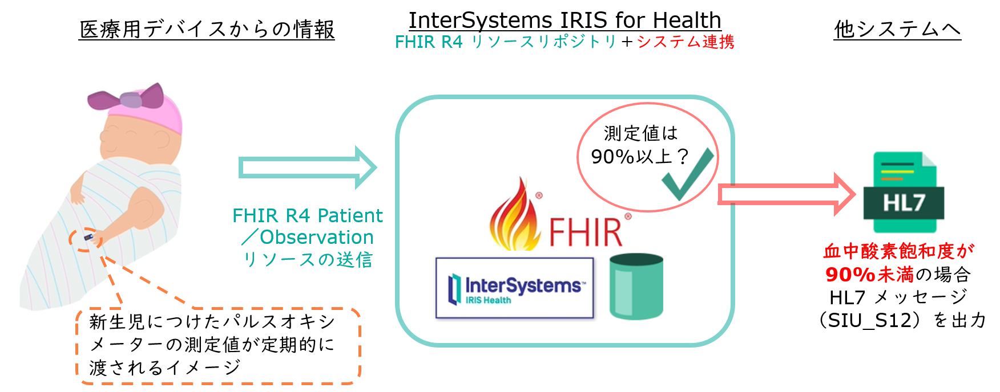
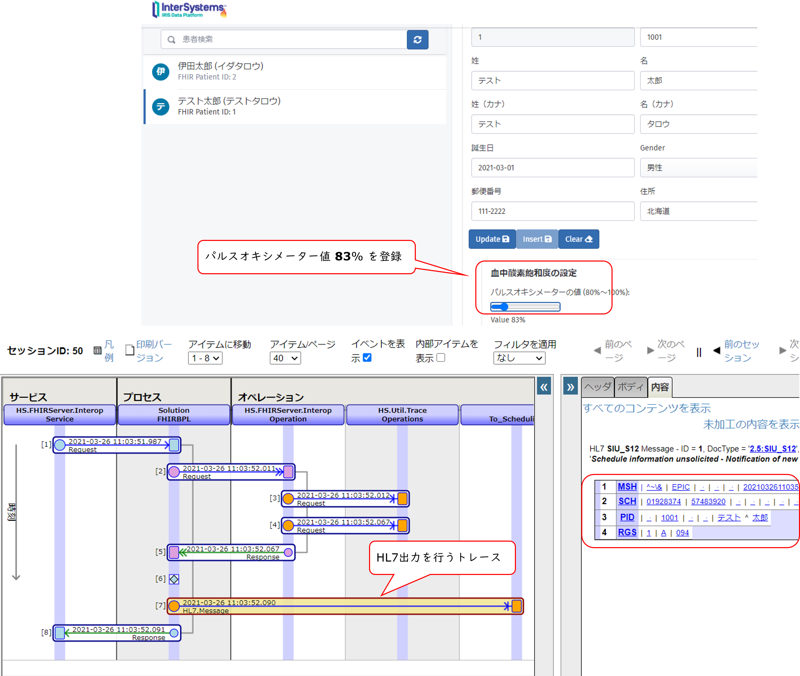

# FHIR R4 リソースリポジトリと FHIR サーバサイドアプリケーションを利用したデータ追跡を簡単に試せる開発環境テンプレート

開発環境テンプレートは、コンテナで動作します。

コンテナのビルドによって、FHIR R4 リソースリポジトリの準備と、FHIR R4 リソースに対応したサンプル Web アプリケーションを準備します。

コンテナのビルド後の開始では、FHIRリソースデータは登録されていませんので、[サンプル Web アプリケーションから登録](#サンプル-Web-アプリケーションについて)したり、[RESTクライアントを利用して登録](#rest-クライアントを利用して-fhir-リソースへのアクセスを試される場合)したり、お好みの方法でお試しいただけます。


この他、コンテナビルド時に FHIR サーバーサイドアプリケーションサンプルの例として、新生児につけたパルスオキシメーターの飽和酸素度が 90% 未満となる場合、HL7 の 2.5:SIU_S12 メッセージを作成しファイル出力するプロダクションサンプル（Interoperabilityメニュー）も一緒に準備しています。

[詳細は後述](#FHIR-サーバサイドアプリケーション（飽和酸素度の追跡と-HL7-メッセージの出力）について)します。


**処理概要（イメージ図）**



この Git のサンプルはコンテナをビルドするだけで開始できます（[docker-compose.yml](./docker-compose.yml) を利用しています）。


## テンプレートで使用している FHIR R4 リポジトリ

InterSystems IRIS for Health コミュニティエディションを使用しています（コンテナビルド時に FHIR R4 リソースリポジトリ用の必要な設定を行っています）。


## テンプレートを動かすための必要な環境

docker / docker-compose / git / VSCode がインストールされた環境をご準備ください。


## コンテナ開始までの手順

**Linux でお試しいただく場合は [start.sh](./start.sh) を実行してください。**

*Windowsでお試しいただく場合は [start.bat](./start.bat)を実行してください。*


コンテナ詳細は、[docker-compose.yml](./docker-compose.yml) をご参照ください。

Git展開後、**./Out は コンテナ内 /ISC/Out ディレクトリをマウントしています。**

また、IRIS for Health の管理ポータル起動に使用する Web サーバポートは 62773 が割り当てられています。

既に使用中ポートの場合は、[docker-compose.yml](./docker-compose.yml) の **9行目** を修正してご利用ください。

**≪62773に割り当てる例≫　- "62773:52773"**


### コマンド実行例

1) git clone

```
git clone https://github.com/Intersystems-jp/IRIS-FHIR-Oximeter-Template
```

2) cloneしたディレクトリに移動

```
cd IRIS-FHIR-Oximeter-Template
```

3) コンテナ開始の為、[start.sh](./start.sh) または [start.bat](./start.bat) を実行

*Linux*
```
$ ./start.sh
```

*windows*
```
> ./start.bat
```


**コンテナを停止する方法**

```
$ docker-compose stop
```


**コンテナを破棄する方法（コンテナを消去します）**

**注意：コンテナを破棄するとコンテナ内に配置されたFHIRリソースリポジトリもコンテナと一緒に破棄されます**

```
$ docker-compose down
```


## サンプル Web アプリケーションについて

サンプル Web アプリケーションでは、新生児の患者基本情報登録／更新（[Patient リソース](http://www.hl7.org/fhir/patient.html)の登録）とパルスオキシメーターで測定した血中飽和酸素度の登録（[Observation リソース](http://www.hl7.org/fhir/observation.html)の登録）が行えます。


**サンプルアプリケーション　イメージ図**


>*補足*
>
>コンテナビルド時、[OpenExchange](https://openexchange.intersystems.com/) に公開されている [iris-fhir-portal](https://openexchange.intersystems.com/package/iris-fhir-portal) をインストールし（[zpmコマンド](https://openexchange.intersystems.com/package/ObjectScript-Package-Manager)を利用）、飽和酸素度チェック用プロダクション（Interoperabilityメニュー）のテーマに合わせ少しウェブアプリケーションの表示項目や動作に改良を加えています。


>[iris-fhir-portal](https://openexchange.intersystems.com/package/iris-fhir-portal) について詳しくは、開発者の[Henrique Goncalves Dias](https://community.intersystems.com/user/henrique-dias-2)さんによる[日本語による概要解説](https://jp.community.intersystems.com/node/480901)もあります。
>
>ぜひご参照ください。


サンプル Web アプリケーションは以下URLで起動します。

http://localhost:62773/fhir/portal/patientlist.html

※ **ホスト名:ポート番号**は、ご利用環境に合わせてご変更ください。

サンプルデータは未登録です。アプリケーションを通して登録されるか、REST クライアントを利用して登録してください。

RESTクライアントからの登録については、[後述の説明](#rest-クライアントを利用して-fhir-リソースへのアクセスを試される場合)をご参照ください。


### (1) Patient リソースの新規登録

Web アプリケーションの右画面の「診察券番号」～「住所」までの必須項目を記入し、「Insert」ボタンをクリックすると登録できます。


### (2) Patient リソースの検索

Web アプリケーションの左画面の「患者検索」のテキストボックスに名前（姓、名、カナ姓、カナ名）で検索できます。

検索結果一覧をクリックすると、右画面に詳細情報を表示します。


### (3) Patient リソースの更新と、酸素飽和濃度の登録（Observation リソースの登録）

左画面の検索結果一覧クリック後、右画面の「血中酸素飽和度の選択」のスライドバーを利用して濃度を指定し、「Update」ボタンをクリックします。


Bundleリソースを利用して、FHIRリポジトリにPatientリソースの更新情報とObservationリソースの情報を登録します。
登録後、再度患者一覧から対象データをクリックすると、右画面の「Vital Signs」に登録した情報が表示されます。


## REST クライアントを利用して FHIR リソースへのアクセスを試される場合

Postman などの REST クライアントをご用意ください。

### (1) Patient リソースの POST

[Patient リソース](http://www.hl7.org/fhir/patient.html) の新規登録を行う方法は以下の通りです。

URLに http://localhost:62773/csp/healthshare/r4fhirnamespace/fhir/r4/Patient を指定します。

※ ポート番号は環境に応じてご変更ください


ヘッダに以下の情報を登録してください。

**Content-Type** に **application/fhir+json;charset=utf-8** を設定

**Authorization** に ユーザ名：_system  パスワード：SYS を設定（Basic 認証を利用したいので RESTクライアントのユーザ名／パスワード入力欄が利用できると便利です）

**Body**に [SampleResourceフォルダにあるPatient新規登録用JSON](./SampleResource/test_Patient.json)の中身を貼り付けます。

HTTPステータスに201 Created が返れば成功です。

登録されたリソース ID を確認するため、GET要求でPatientリソースを取得します。

登録した「山田太郎」さんのリソース ID は、検索結果の Bundle リソースの entry の resource の id で確認できます。


### (2) (1)で作成した Patient リソースと関連付けた Observation リソースの POST

[Observation リソース](http://www.hl7.org/fhir/observation.html) の新規登録を行う方法は以下の通りです。

URLに http://localhost:62773/csp/healthshare/r4fhirnamespace/fhir/r4/Observation を指定します。

※ ポート番号は環境に応じてご変更ください


ヘッダに以下の情報を登録してください。

**Content-Type** に **application/fhir+json;charset=utf-8** を設定

**Authorization** に ユーザ名：_system  パスワード：SYS を設定（Basic 認証を利用したいので RESTクライアントのユーザ名／パスワード入力欄が利用できると便利です）

**Body**に [SampleResourceフォルダにある Observation 新規登録用JSON](./SampleResource/test_Observartion_Refer_Patient_1.json)の中身を貼り付けます。

[サンプルJSON](./src/SampleResource/test_Observartion_Refer_Patient_1.json) の 56行目に、(1)　の Patientリソース の POST 実行で付与されるリソース ID（例では 5）を *Patient/5* のように設定しています。

POST実行後、HTTP ステータスに 201 Created が返れば成功です。


### (3) Bundleの利用：Patient リソースの新規登録（POST）と Observation リソースの新規登録（POST）

[Bundle リソース](http://www.hl7.org/fhir/bundle.html) で更新する方法は以下の通りです。


ヘッダに以下の情報を登録してください。

**Content-Type** に **application/fhir+json;charset=utf-8** を設定

**Authorization** に ユーザ名：_system  パスワード：SYS を設定（Basic 認証を利用したいので RESTクライアントのユーザ名／パスワード入力欄が利用できると便利です）

**Body** に [SampleResourceフォルダにある Bundle用JSON](./SampleResource/test_Bundle_Patient_Observation.json)の中身を貼り付けます。

サンプルでは、Patient リソースの新規登録（POST）と Observation リソースの新規登録（POST）を行うため、Bundle リソースを使用しています。

POST実行後、HTTP ステータスに 200 OK が返れば成功です。
また、応答メッセージを確認すると Patient／Observation それぞれの登録に対して、HTTP ステータス 201 が返送されていることが確認できます。


## FHIR サーバサイドアプリケーション（飽和酸素度の追跡と HL7 メッセージの出力）について

開発環境テンプレートの FHIR R4 リソースリポジトリでは、InterSystems IRIS for Health コミュニティエディション（以降 IRIS for Health）を使用しています。

IRIS for Health では、FHIR R4 リソースリポジトリの提供の他に、FHIR サーバーサイドアプリケーションの開発も行え、テンプレートには、新生児につけたパルスオキシメーターの飽和酸素度が 90% 未満となる場合、HL7 の 2.5:SIU_S12 メッセージを作成しファイル出力するプロダクションサンプル（Interoperabilityメニュー以下で作成するサンプル）も含まれます。

IRIS for Health では、FHIR R4 リソースリポジトリを用意すると同時に REST のエンドポイントも作成します。

FHIR R4 リソースリポジトリのエンドポイントが提供されている環境に、以下の図のようなプロダクション定義が登録されていると、REST で依頼された FHIR R4 リソースリポジトリの処理は、プロダクションのビジネスサービスに送信されるようになります。


**図：プロダクション定義**


プロダクションでは、FHIR R4 リソースリポジトリにリクエストされた HTTP メソッドの依頼の他に、必要に応じて FHIR サーバーサイドアプリケーションを追加できます。


テンプレートの中では、パルスオキシメーターの飽和酸素度が 90% 未満となる場合、HL7 の 2.5:SIU_S12 メッセージを作成しファイル出力する流れを追加しています。

以下画面イメージは、測定値のチェックを行っているビジネスプロセスエディタの例と、90% 未満だった場合のデータ変換エディタの例です。


この流れは、サンプル Web アプリケーションを使用して簡単に確認できます。

以下画面イメージは、適正値（飽和酸素度が 90% 以上）の場合のトレース例です。


以下の画面イメージは、適正値（飽和酸素度が 90% ）を下回る場合 HL7 出力の流れを確認できるメッセージのトレース例です。



